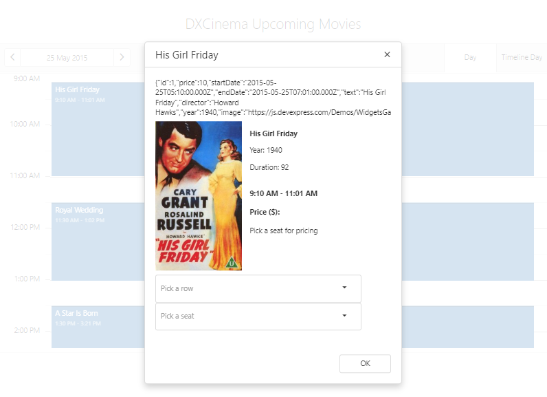

<!-- default badges list -->

<!-- default badges end -->
# Scheduler for DevExtreme - How to create a custom editing form

This example demonstrates how to create a custom editing form for appointments.

The main idea is to use a [Popup](https://js.devexpress.com/Documentation/ApiReference/UI_Widgets/dxPopup/) to display appointment data and to update appointments by calling methods from the [Scheduler API](https://js.devexpress.com/Documentation/Guide/Widgets/Scheduler/Appointments/Update_Appointments/#API).

In our particular case, we use a custom editing form to select a seat for a chosen movie.

## Files to Review

- **jQuery**
    - [index.html](jquery/index.html)
    - [script.js](jquery/script.js)
- **Angular**
    - [app.component.html](angular/src/app/app.component.html)
    - [app.component.ts](angular/src/app/app.component.ts)
- **Vue**
    - [App.vue](vue/src/App.vue)
- **React**
    - [App.js](react/src/App.js)
- **ASP.Net Core**    
    - [Index.cshtml](ASP.NET%20Core/ASP.NET%20Core/Views/Home/Index.cshtml)
    
## Documentation

- [Getting Started with Scheduler](https://js.devexpress.com/Documentation/Guide/UI_Components/Scheduler/Getting_Started_with_Scheduler/)

- [Scheduler - API Reference](https://js.devexpress.com/Documentation/ApiReference/UI_Components/dxScheduler/)
